# S3 Static Website + CloudFront CDN + Route53

I deployed a static website deployed using S3 for hosting, CloudFront for CDN and HTTPS and Route53 for DNS.

## The Objective

Deploy a static website on:

* S3 (hosting)
* CloudFront (CDN + HTTPS)
* Route53 (domain routing)

## Task 1: Static Website Bucket

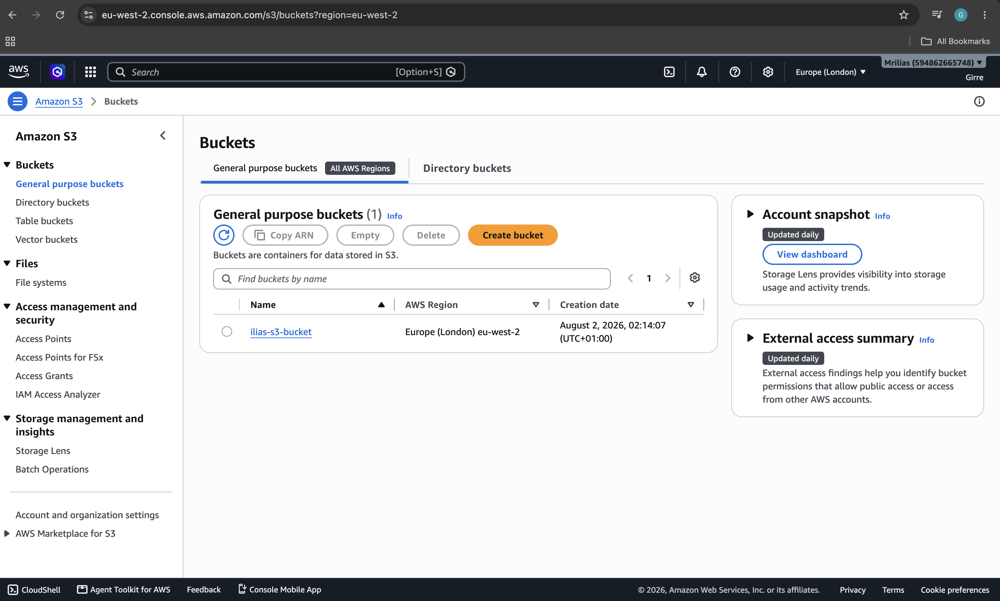
Created the S3 bucket (ilias-s3-bucket) in eu-west-2 to host the static site.

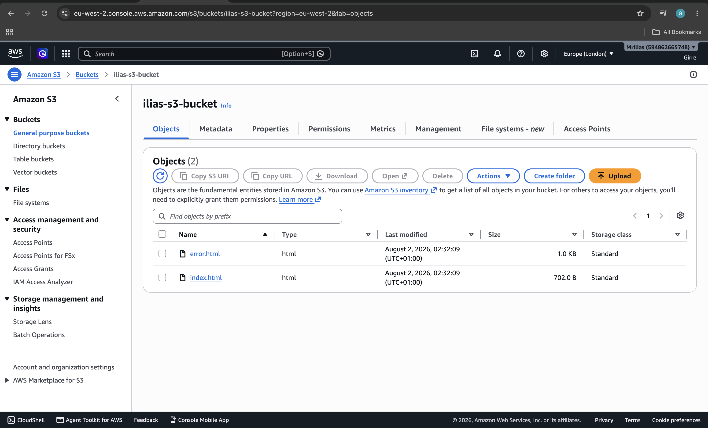
Uploaded index.html and error.html to the bucket.

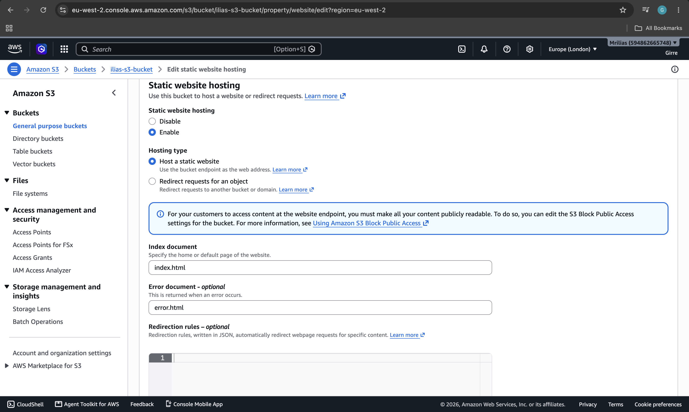
Enabled static website hosting, set index.html as the index document and error.html as the error document.

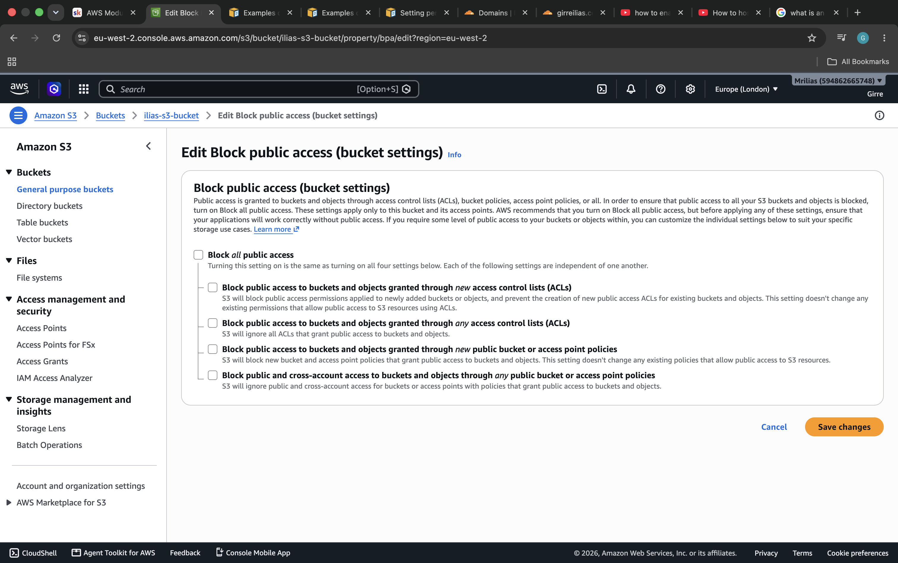
Edited Block Public Access settings to allow the bucket to be made public.

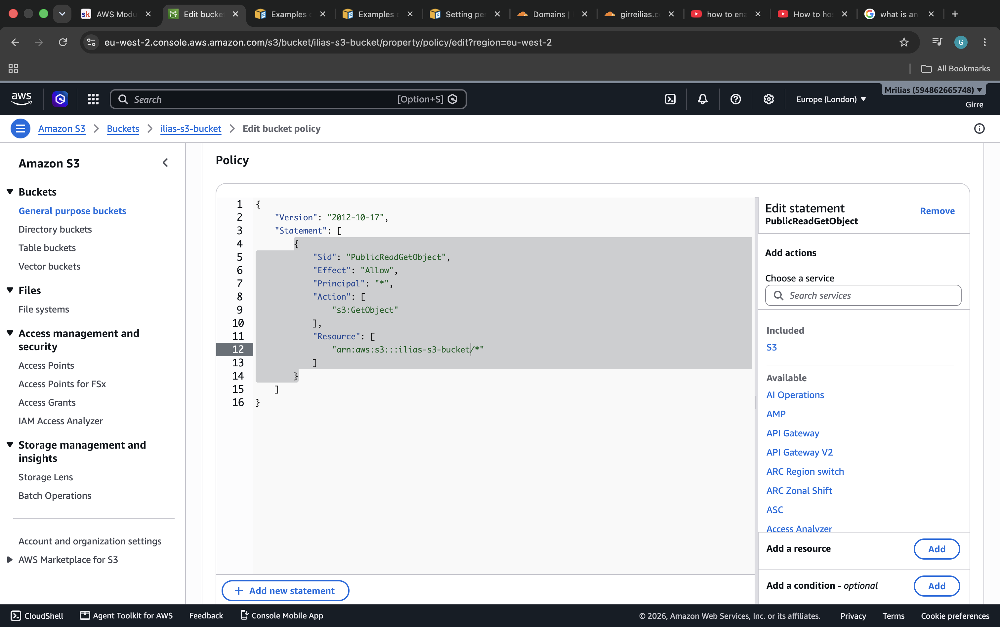
Added a bucket policy granting public GetObject access so the site can be read.

## Task 2: Set Up CloudFront

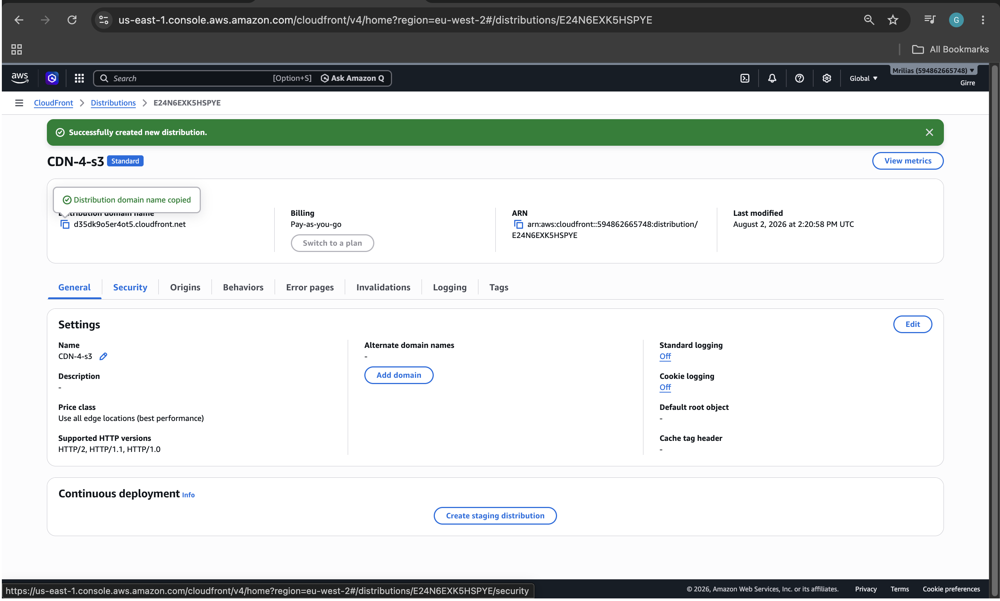
Created the CloudFront distribution (CDN-4-s3) with the S3 bucket as the origin.

## Task 3: Route53 Setup

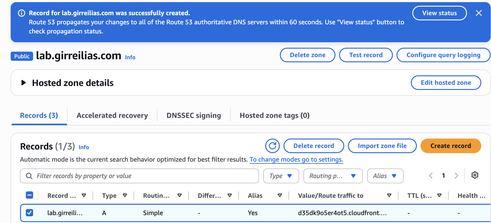
Created a Route 53 A record (Alias) for lab.girreilias.com pointing to the CloudFront distribution.

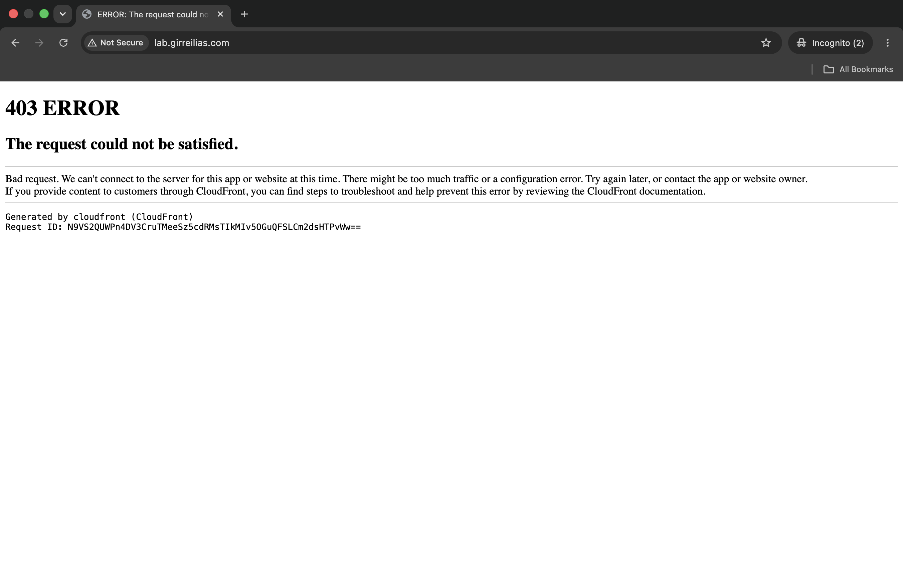
Domain is registered with Cloudflare, so delegated the lab subdomain to Route 53 by adding the four Route 53 NS records inside Cloudflare's DNS.

## Testing and Troubleshooting

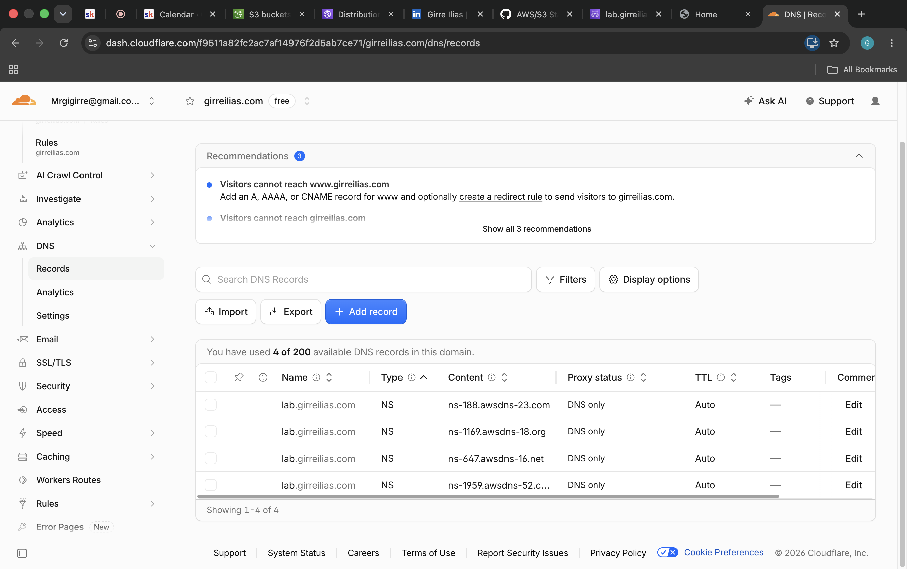
First attempt to load lab.girreilias.com returned a CloudFront 403, caused by not having added the domain as an alternate domain name on the distribution yet.

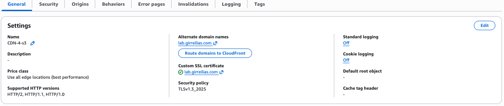
Fixed the 403 by adding lab.girreilias.com as an Alternate Domain Name on the CloudFront distribution and attaching an ACM SSL certificate for it.

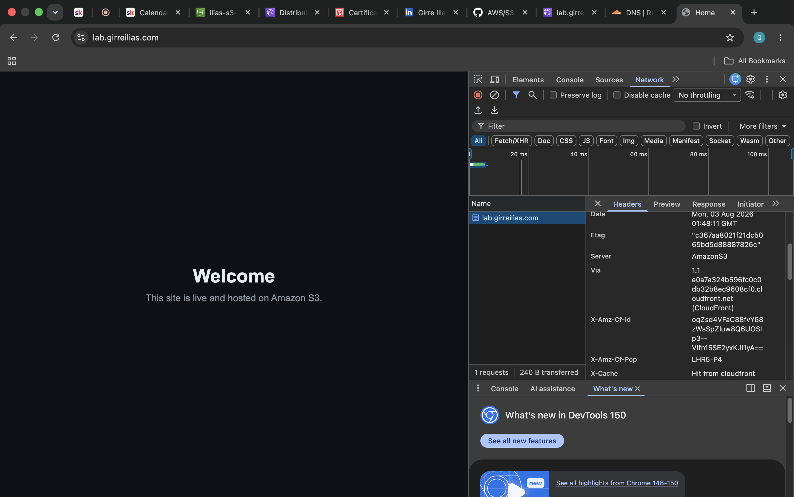
Site loads correctly over HTTPS; dev tools confirms X-Cache: Hit from cloudfront, meaning CloudFront is serving the content.

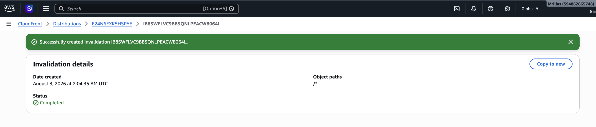
Created a CloudFront invalidation (/*) after editing index.html, to clear the stale cache.

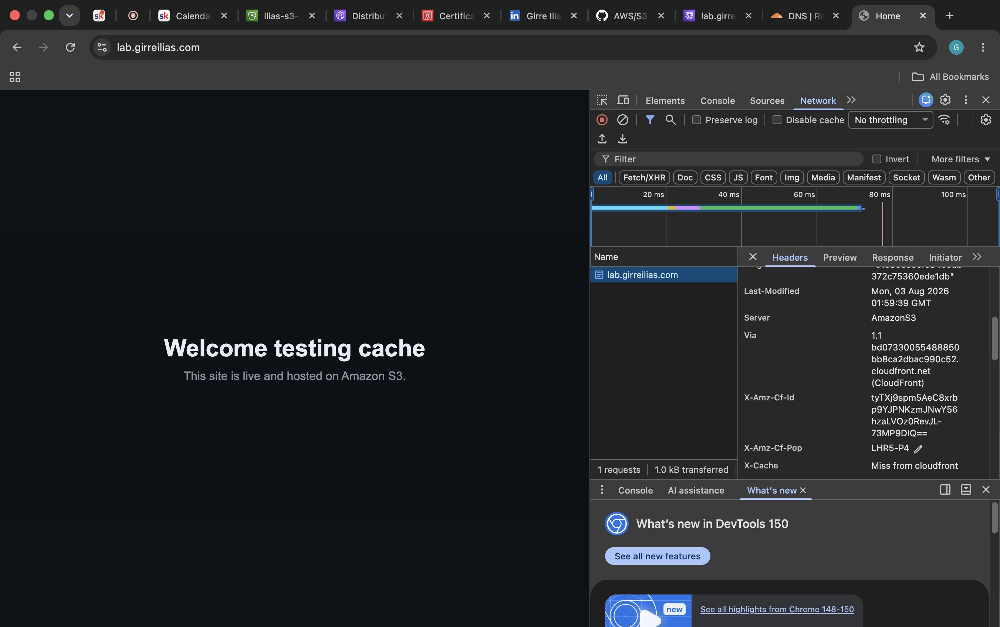
Refreshed the page and confirmed the updated content loaded with X-Cache: Miss from cloudfront, confirming the invalidation worked and fresh content was pulled from origin.